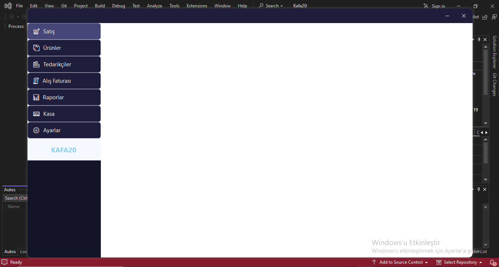
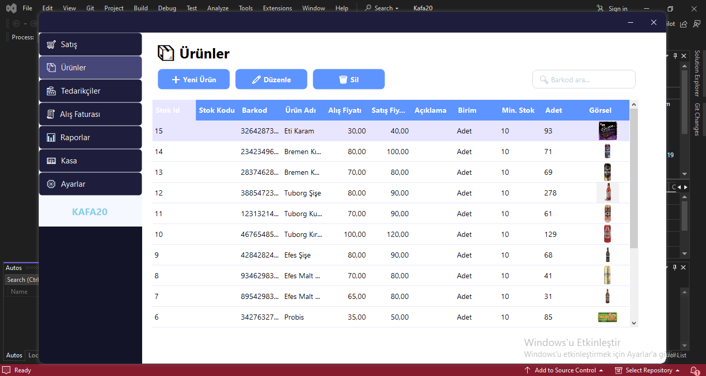
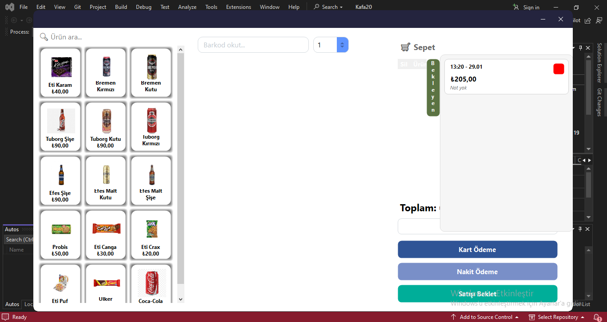
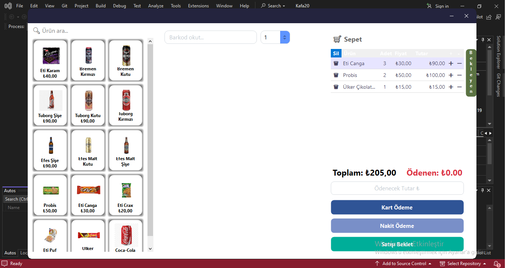
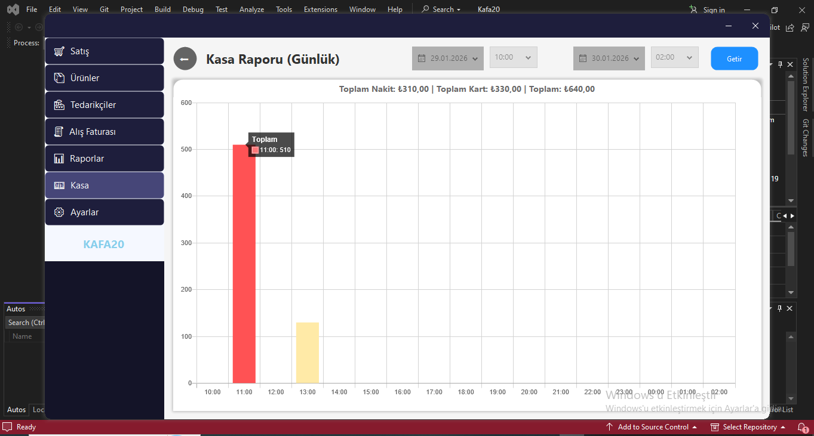
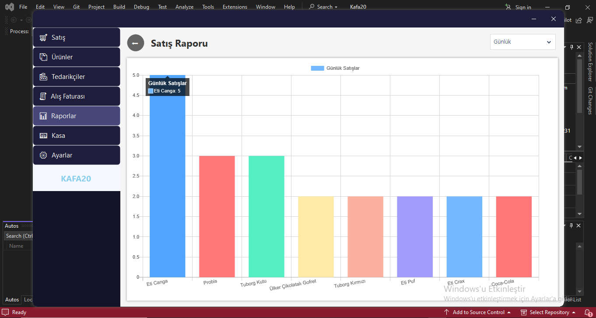
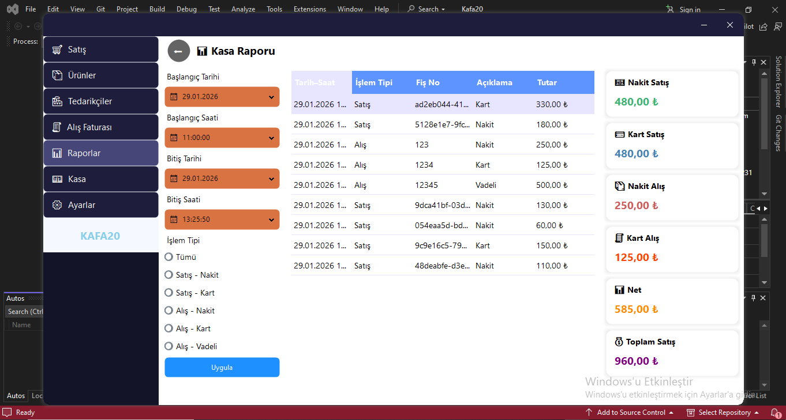
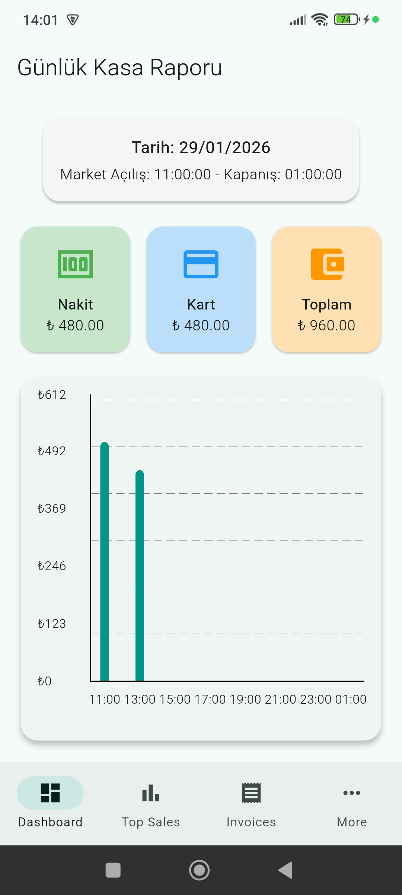
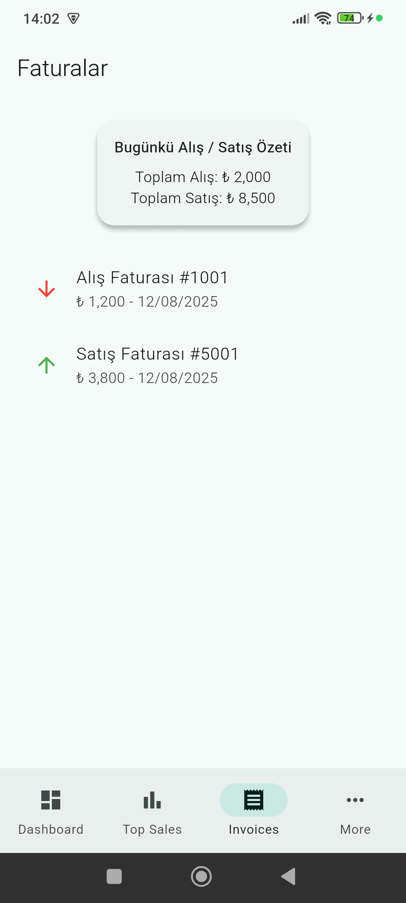
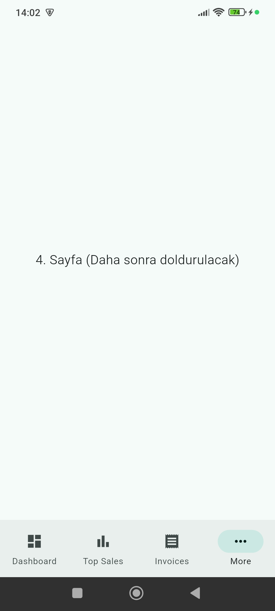

# 🛒 Market Management & Reporting System (Full-Stack)

Bu proje; bir marketin stok, satış ve alış süreçlerini yöneten masaüstü uygulaması ile bu verileri anlık olarak takip eden mobil raporlama uygulamasından oluşan uçtan uca bir sistemdir.

## 🏗️ Mimari Yapı (N-Tier Architecture)
Proje, katmanlı mimari (N-Tier) prensiplerine uygun olarak, kodun sürdürülebilirliği ve test edilebilirliği ön planda tutularak geliştirilmiştir:

- **Desktop (Presentation):** WinForms & Guna2 UI ile modern kullanıcı arayüzü.
- **Web API (Backend):** .NET Core API ile güvenli veri servisi ve mobil senkronizasyon.
- **Mobile:** Flutter & Dart ile cross-platform raporlama arayüzü.
- **Database:** MSSQL üzerinde kurgulanmış ilişkisel veritabanı yapısı.

## 🛠️ Teknik Detaylar
- **Mimari:** Repository Pattern, Dependency Injection, DTO (Data Transfer Objects).
- **Backend:** Controller-Service-Repository katmanları arası izolasyon.
- **Mobile:** REST API entegrasyonu ve JSON veri işleme.

## 📂 Klasör İçerikleri
- **01-Desktop-App:** UI tasarımları ve DAL (Data Access) örnekleri.
- **02-Web-API:** Business logic ve Controller yapıları.
- **03-Mobile-App:** API istemcisi ve veri modelleri.
- **04-Database:** Veritabanı şeması (.sql script).
- **05-Screenshots:** Uygulama içi görseller.
## 📸 Uygulama Görselleri

### 🖥️ Masaüstü Uygulaması (C# WinForms)

  
  

  
  

  
  

  

### 📱 Mobil Raporlama (Flutter)

  
  
  

---
⚠️ **Not:** Güvenlik ve fikri mülkiyet hakları gereği projenin tüm kaynak kodları paylaşılmamıştır. Mimari tasarımı incelemek için klasörlerdeki örnek kod dosyalarına göz atabilirsiniz.
